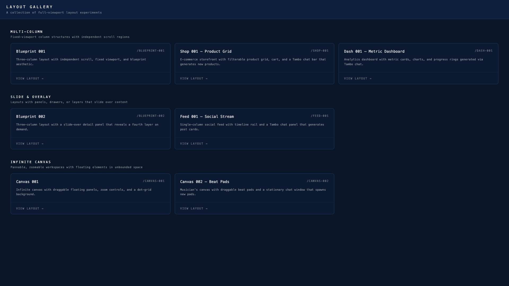
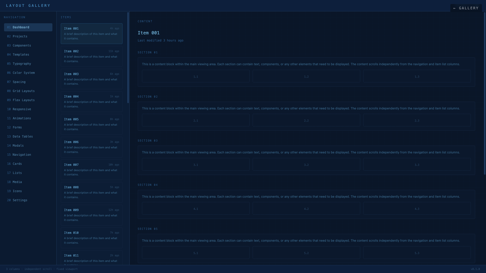
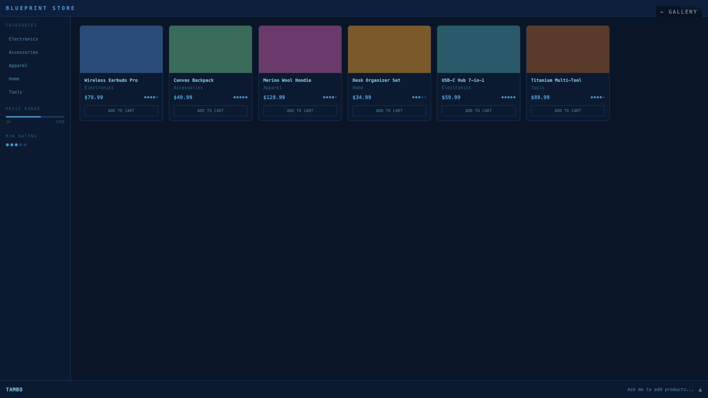
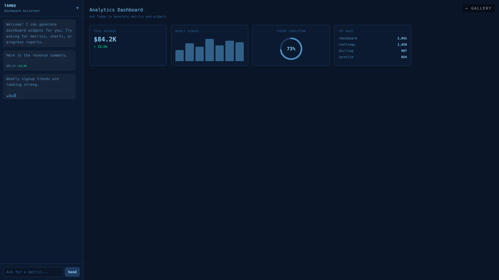
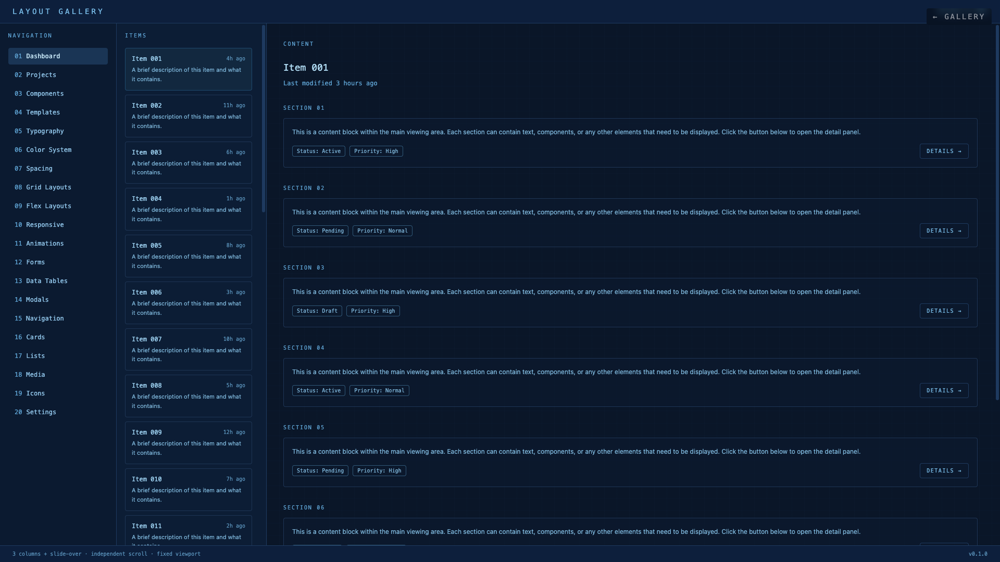
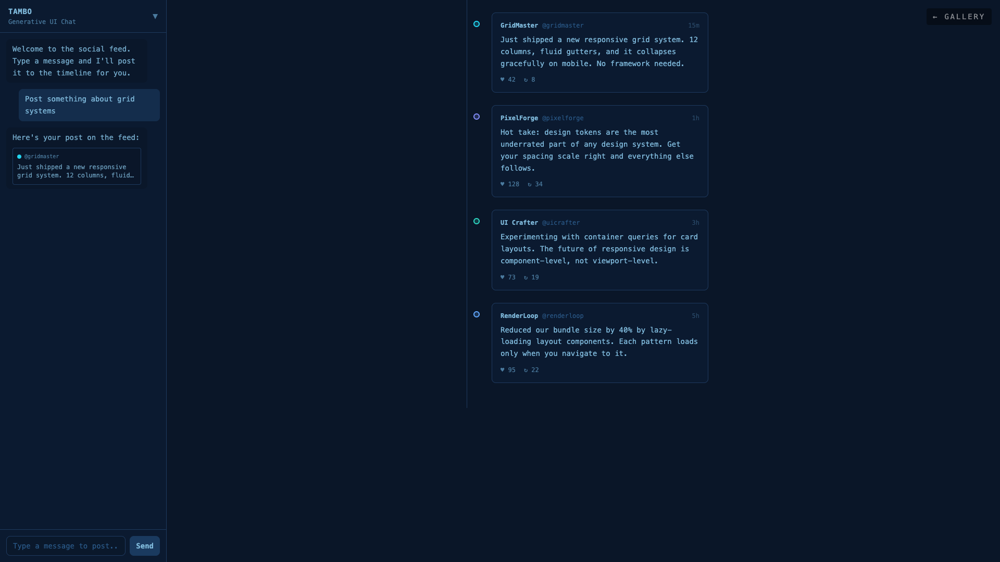
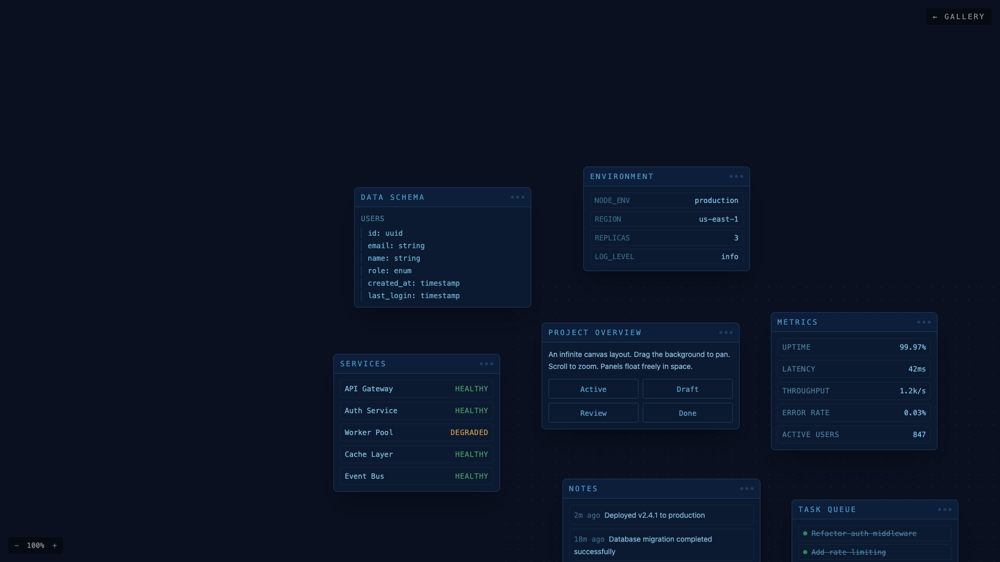
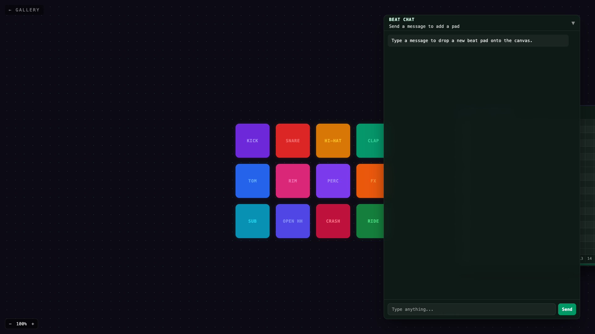

# Layout Gallery

A collection of full-viewport, interactive layout patterns built with React 19 + TypeScript + Tailwind CSS + Vite.



## Layouts

### Multi-Column

| Blueprint 001 | Shop 001 — Product Grid | Dash 001 — Metric Dashboard |
|---|---|---|
|  |  |  |
| Three-column layout with independent scroll, fixed viewport, and blueprint aesthetic. | E-commerce storefront with filterable product grid, cart, and a Tambo chat bar. | Analytics dashboard with metric cards, charts, and progress rings generated via Tambo chat. |

### Slide & Overlay

| Blueprint 002 | Feed 001 — Social Stream |
|---|---|
|  |  |
| Three-column layout with a slide-over detail panel that reveals a fourth layer on demand. | Single-column social feed with timeline rail and a Tambo chat panel that generates post cards. |

### Infinite Canvas

| Canvas 001 | Canvas 002 — Beat Pads |
|---|---|
|  |  |
| Infinite canvas with draggable floating panels, zoom controls, and a dot-grid background. | Musician's canvas with draggable beat pads, piano roll sequencer, and a chat window that spawns new pads. |

## Getting Started

```bash
npm install
npm run dev
```

## Commands

```bash
npm run dev        # Start Vite dev server with HMR
npm run build      # TypeScript check + Vite production build
npm run lint       # ESLint (flat config, ESLint 9+)
npm run preview    # Preview production build locally
```

## Adding a New Layout

1. Create a directory under `src/layouts/` (e.g., `my-layout/`)
2. Add the component file and optional CSS
3. Register it in `src/layouts/registry.ts` with metadata and a lazy import

## Tech Stack

- **React 19** with TypeScript (strict mode)
- **Tailwind CSS** — dark blueprint aesthetic with deep blues, cyan accents, monospace throughout
- **Vite** — dev server + production bundler
- **React Router** — `/` gallery grid, `/layouts/:slug` individual layouts
- **Code-splitting** via `React.lazy()` per layout
